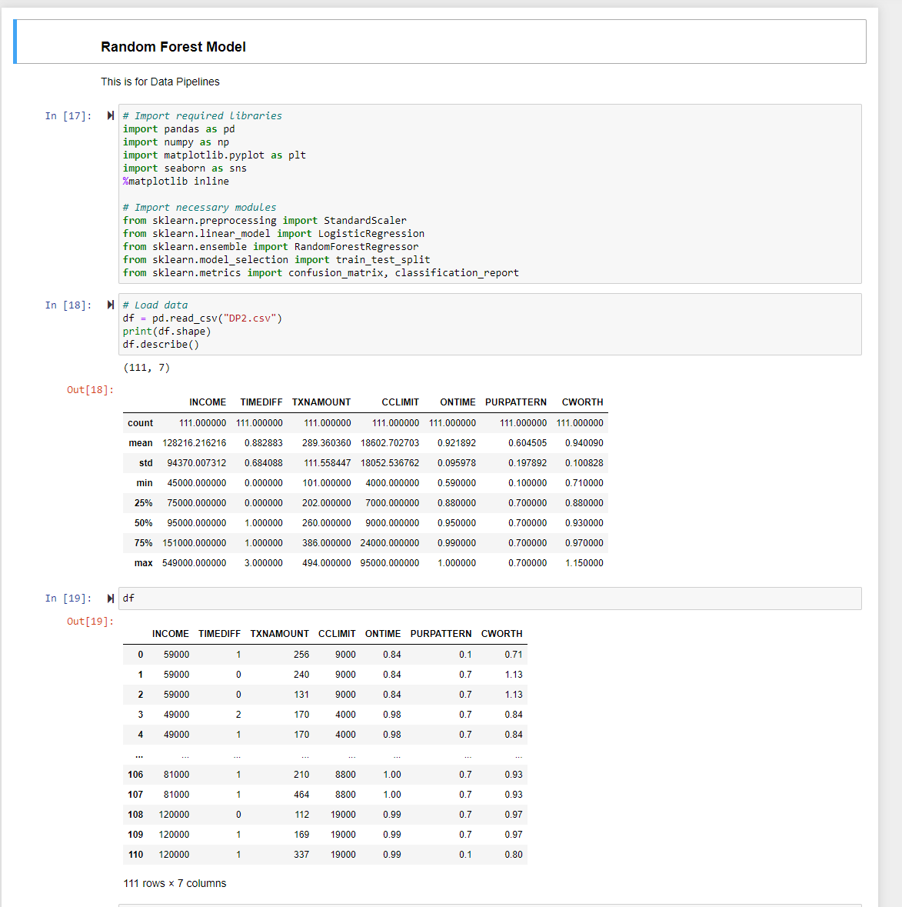
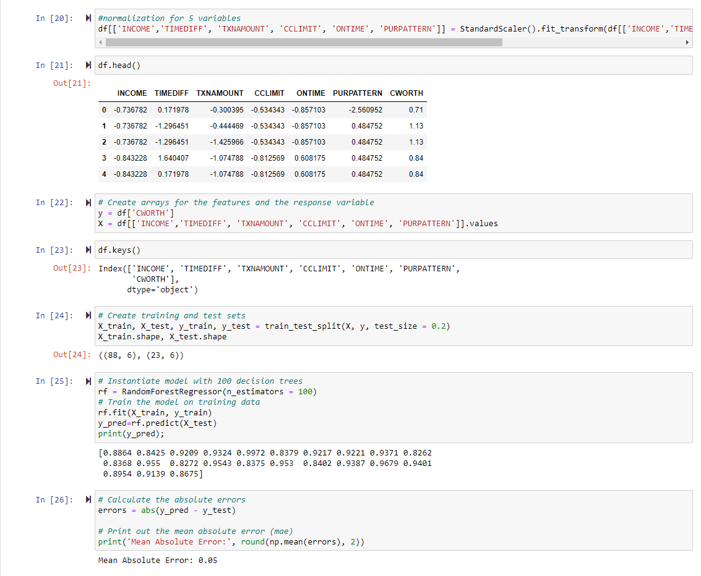
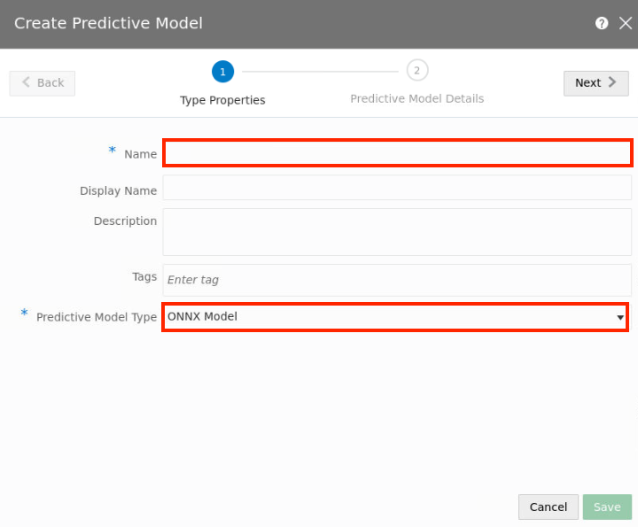

# Create OML model

## Introduction

In this lab, we will import a Machine Learning model that was previously trained using Python and converted into an Open Neural Network Exchange (ONNX) format.  

**Note**: This lab is for demonstration purposes only.

Estimated Time: 15 minutes

### Objectives

In this lab, you will complete the following tasks:

- Examine Predictive Model
- Create Predictive model

### Prerequisites

This lab assumes you have:
- An Oracle Always Free/Free Tier, Paid or LiveLabs Cloud Account

## Task 1: Examine Predictive Model
1. The following steps will describe the steps taken to write the ONNX file that will be used to create the model in task 2.
2. The following image shows the first three paragraph's in the page and the outputs generated.
- In [17], the necessary libraries and models are imported.
- In [18], the csv containing the model data is read and then stored in a data frame titled **df** first. Next, using **df.shape**, the number of rows and columns contained in the dataframe is printed. Finally, using **df.describe()**, a summary of statistics for each column is outputed.
- In [19], the contents of the dataframe are outputed.
     
3. The following image shows the next seven paragraphs in the page and the outputs generated.
- In [20], the values for the columns within the data frame are normalized. This transforms the values to a common scale to allow for a more fair comparison between variables.
- In [21], the line will output the first five rows of the datafarme after the normalization step.
- In [22], we create arrays for the features, or the independant, and the response, or dependant, variables.
- In [23], the line will output the names of the columns within the data frame along with the data type.
- In [24], the first line creates train and test data sets for the **X** and **y** arrays. The next line outputs the shapes of the X_train and X_test sets.
- In [25], the first line instantiates a model with 100 decision trees. The next three lines trains the model on the training data, stores the predicted values in the **y_pred** variable and then prints the values.
- In [26], the first line calculates the absolute errors and and stores it in the **errors** variable. The next line prints the MAE, the mean absolute error, of the **error** variable.
     
4. The following image shows the next three paragraphs in the page and the outputs generated.
- In [27], the MAPE, mean absolute percentage error, is calculated and stored in the **mape** variable. The next two lines calculates the accuracy using the **mape** and then prints the value rounded two decimals.
- In [66], this block will write the ONNX file.
     
## Task 2: Create Predictive Model

1. With the GGSA Catalog open, select **Create New Item** and from the drop down menu, select **Predictive Model**. 

     

2. In the new window that opens, add a name to the model and select Predictive Model Type **ONNX**. Select **Next** to proceed to updating the rest of the details.

     

3. Upload the Predictive Model URL and type in the model version, in this case **1.0**.The rest of the fields in the form will be automatically be filled following the file upload. After these steps, click on the green **save** button.

     

You may now **proceed to the next lab.**

## Acknowledgements

- **Author**- Nicholas Cusato, Santa Monica Specialists Hub, July 14, 2022
- **Contributers**- Hadi Javaherian, Hannah Nguyen, Gia Villanueva, Akash Dahramshi
- **Last Updated By/Date** - Nicholas Cusato, North America Specialists Hub, July 14, 2022