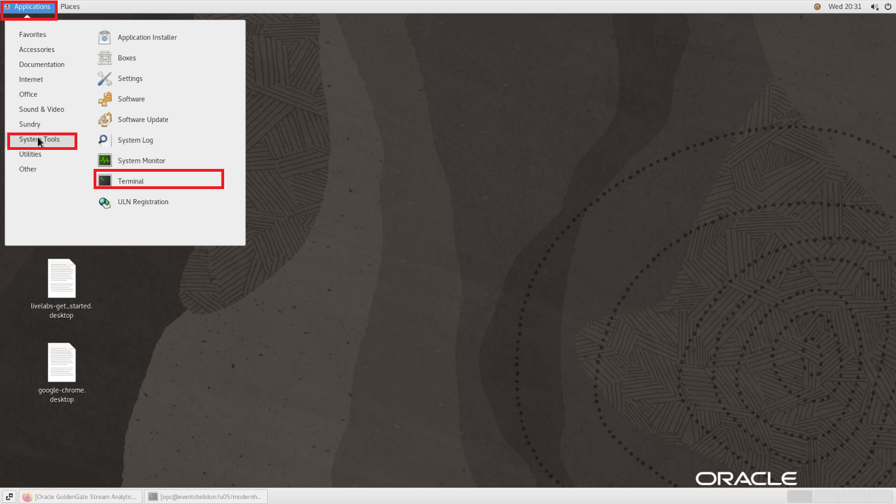

# Access environment and explore setup 

## Introduction

In this lab, you will explore the Data Mesh environment, discovering key components such as GoldenGate, Oracle Database, and Helidon.

The helidon microservice is a a basic REST API that queries the database for data products. These data products are the result of the GoldenGate Streaming Analytics pipeline

Estimated Time: 10 minutes

### Prerequisites

- Access to the `dmsafeevents` compute instance.


### Objectives

In this lab, you will:

- Access the GoldenGate Stream Analytics environment
- Access the Helidon environment

## Access the GoldenGate Stream Analytics environment

1. Once you are in the instance, access the terminal.

    

2. Open Firefox

    

3. In the address bar, insert the URL to the GoldenGate Stream Analytics.

    ```
    <copy>https://ggsaevents/osa/#welcome</copy>
    ```

4. You will be prompted with a login screen, insert the username and password.

    ```
    Username: <copy>osaadmin</copy>
    ```

    ```
    Password: <copy>welcome1</copy>
    ```

5. Click on **Catalog** located in the top-right of the screen. 

    

5. Now, use the terminal to access the `helidon` instance via `ssh`.

6. Access the terminal.

    

7. Access the `helidon` host.

    ```
    $ <copy>ssh -i /keys/bastionkey <IP OF INSTANCE></copy>
    ```


8. To run the Helidon microservice, please set the environment first.

    ```
    $ . $PATH_TO_HELIDON_SETUP/setHelidonEnv.sh
    ```

9.  Run the microservice.

    ```
    $ java -jar $PATH_TO_HELIDON_JAR/datamesh.jar
    ```

    This will open the helidon webserver on port 8081.

10. Now, the Helidon microservice is running.

## Acknowledgements

- **Author**- Matthew McDaniel, North America Specialist Hub
- **Last Updated By/Date** - Alpha Diallo, Nicholas Cusato, July 2023
