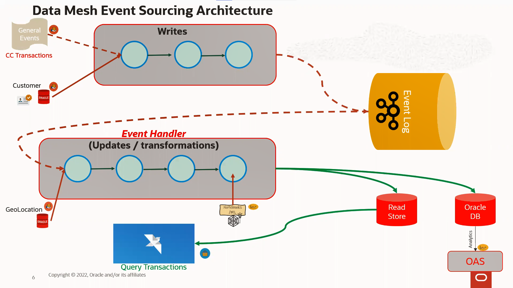
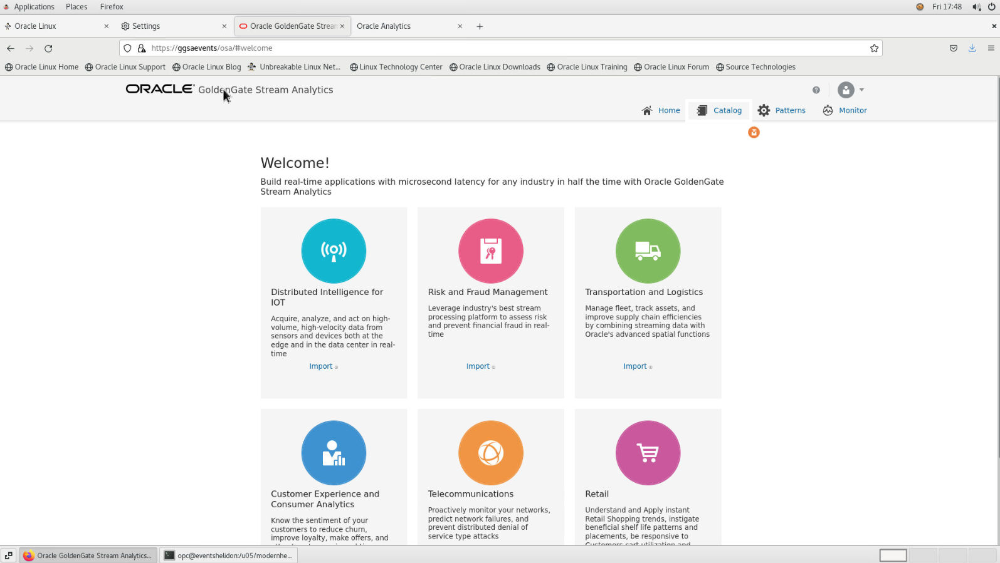
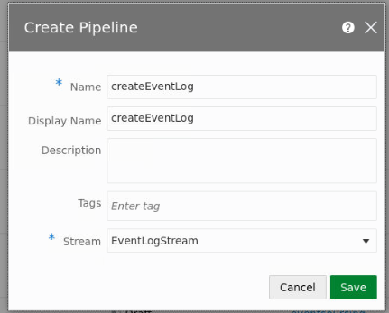
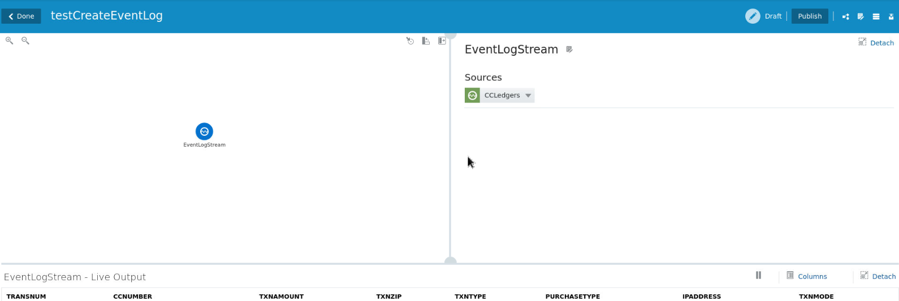

# Set up Event Sourcing pipeline

## Introduction

This hands-on lab is designed to demonstrate how Oracle GoldenGate 19c Microservices can be used to setup a replication environment by a mix of web page, shell scripts and Rest API interfaces.  

The labs will walk the end-user through how to add components of Oracle GoldenGate replication.

*Estimated Lab Time*: 30 mins

### About Oracle GoldenGate Microservices
Oracle GoldenGate offers high-performance, fault-tolerant, easy-to-use, and flexible real- time data streaming platform for big data environments. It easily extends customers’ real-time data integration architectures to big data systems without impacting the performance of the source systems and enables timely business insight for better decision making. This workshop focuses on **GoldenGate Real Time Data Capture** demonstrating four scenarios that you can use (both on-premise and in the cloud) to capture real time data changes from your sources.

### Lab architecture

)

## What is Event Sourcing?

Event Sourcing is an architectural pattern that emphasizes storing changes to domain objects. In effect, this means we can maintain an event log where we can query the changes a domain object has undergone. In our use case, the events that we will be tracking are credit card transactions. Once a transaction is made, it will be picked up by a Kafka Topic and placed within an event log. Following this, the event will be sent through a Golden Gate Stream Analytics pipeline where it will undergo a transformation via filtering and analysis. During this process, we will run the event through a machine learning via Oracle Machine Learning, which will determine whether or not the transaction is fraudulent. 

## What is CQRS

Simply put, CQRS (Command Query Responsibility Segregation) is a software architecture pattern that seperates reads and writes into two separate models. An example of this could be two separate data sources, one which is a read-only database, and the only a write database. Synchronization between these two data stores can be accomplished through an event log (Kafka, for instance). The benefit of this is that, in conjunction with the event sourcing pattern, we can recreate our data stores fairly easily by utlizing the event log, which is updated on a transaction-by-transaction basis. 

## Create Event Log pipeline

For the purpose of this workshop, all data sources, streams, and targets have been preconfigured for your convenience. Your job will be to configure the pipeline and create the transformations that the events will undergo.

1. To start, access the Golden Gate Stream Analytics console in the Firefox web browser, then click **Catalog**.

    

2. Once in the catalog, you will see numerous resources, ranging from streams, targets. In the top-right, click on **Create New Item**. Once the dropdown appears, click **Pipeline**.

3. When the following screen appears, Populate the fields with the following values:

    - **Name**: createEventLog
    - **Display Name**: createEventLog
    - **Description**: *optional*
    - **Tags**: *optional*
    - **Stream**: EventLogStream

    

4. Click **Save*.

5. You should now be within the **createEventLog** pipeline and should see the following view.

    

## Acknowledgements

- **Author**- Matthew McDaniel, Platform Specialists, September 16, 2022
- **Last Updated By/Date** - Matthew McDaniel, Austin Specialist Hub, February 24 2022
