# Data Preparation

## Introduction
 

Estimated Time: 15 minutes

### Objectives

In this lab, you will complete the following tasks:

- Log in to Oracle Analytics Server
- Verify Connection to GGSA Pipeline
- Verify Connection to Oracle Database
- View Scatter Plot
- View Map Visual
- View Line Chart
- View Bar Chart

### Prerequisites

This lab assumes you have:
- An Oracle Always Free/Free Tier, Paid or LiveLabs Cloud Account

## Task 1: Log in to Oracle Analytics Server

1. Sign on to OAS using the Weblogic portal. The username and password should be preconfigured, but if not then use the following:
- username: **weblogic**
- password: **welcome1**

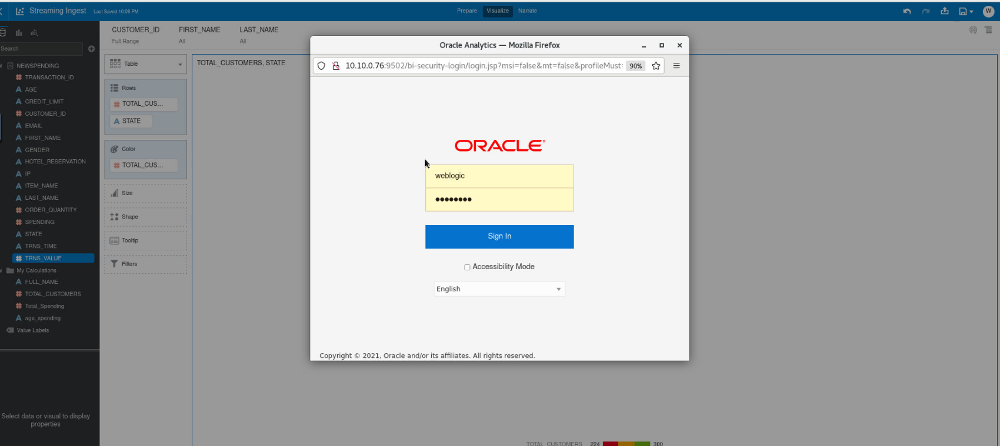

## Task 2: Verify Connection to GGSA Pipeline

1. Open the GGSA portal to view the Analytics Target by selecting **Analytics Target.**

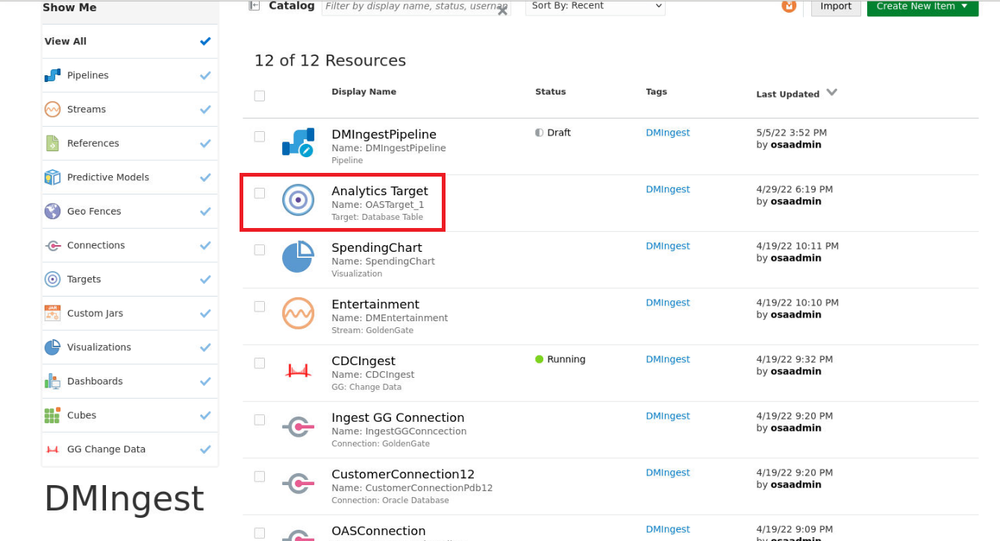

2. View the connection properties by selecting **Next.**

3. Notice the OASConnection selected and select **Next** to view the shape.

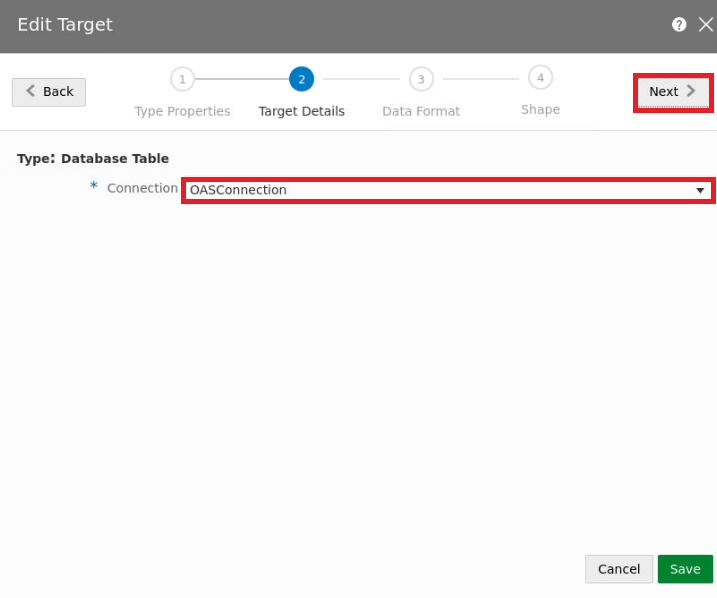

4. Since the pipeline is not published, the table will not be available to view, but here you can select the type of data you would like to analyze.

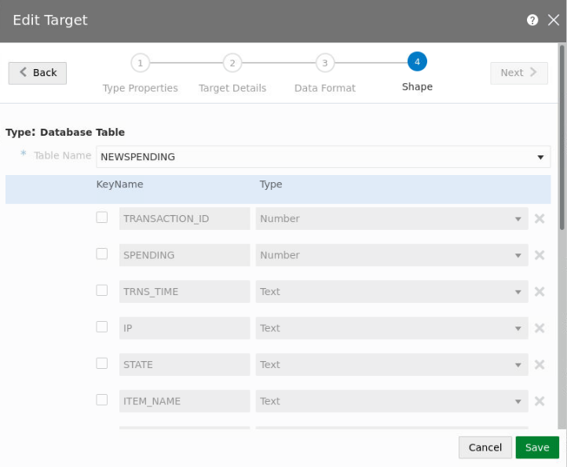

## Task 3: View Scatter Plot

1. In the OAS, ensure that you are viewing the first canvas. If not, select **Canvas 1** at the bottom. The notebook should be loading so the image will be faded, as it fully loads. The status can be seen in the top right of the page as a loading wheel. 

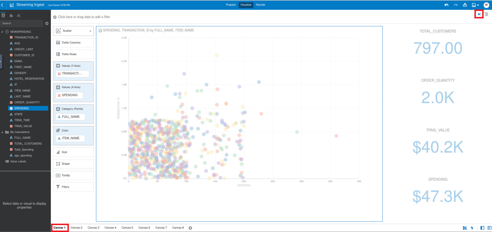

2. On this visualization, spending and transaction ID number are colored by Item Type, such as Drinks, Food, Merchandise, Pictures, and Souvenirs. Next to the chart is a quick glance of statistics, such as Total Customers, Order Quantity, Transaction Value, and Total Spending. 

## Task 4: View Map Visual

1. Select **Canvas 2** to open the map visualization. At a quick glance, we can see the three locations in comparison to eachother. California has the largest transaction value and a similar spending amount as Texas. Texas has a medium amount of transaction value, while Florida has the smallest and a red color for least amount of spending.

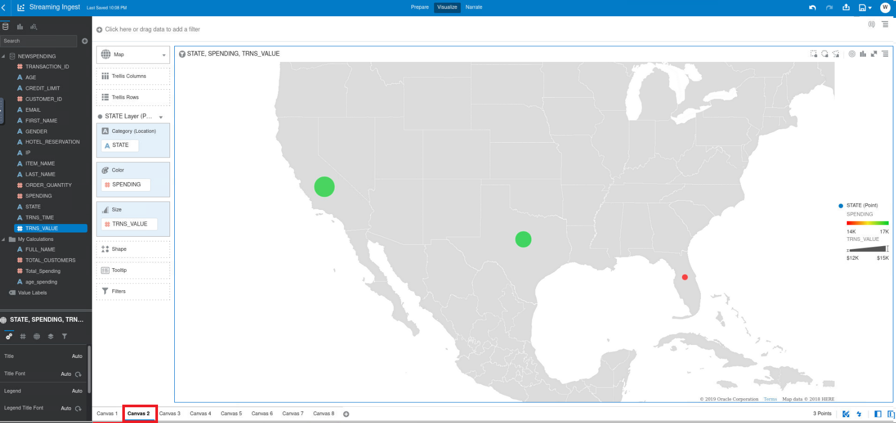

2. Select **Canvas 3** to view the Customer count. This gives context to the data viewed on the previous canvas. The color indicates the amount of customers. Florida, which has the least amount of customers, can be understood for its low spending value.

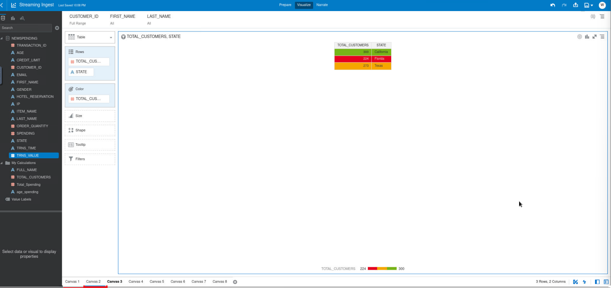

## Task 5: View Line Chart

1. Select **Canvas 4** to observe the first line chart. This shows the peaks of transaction values with respect to time. Events based on time, such as happy hour, could be produce incentives for the customer to spend more per transaction. 

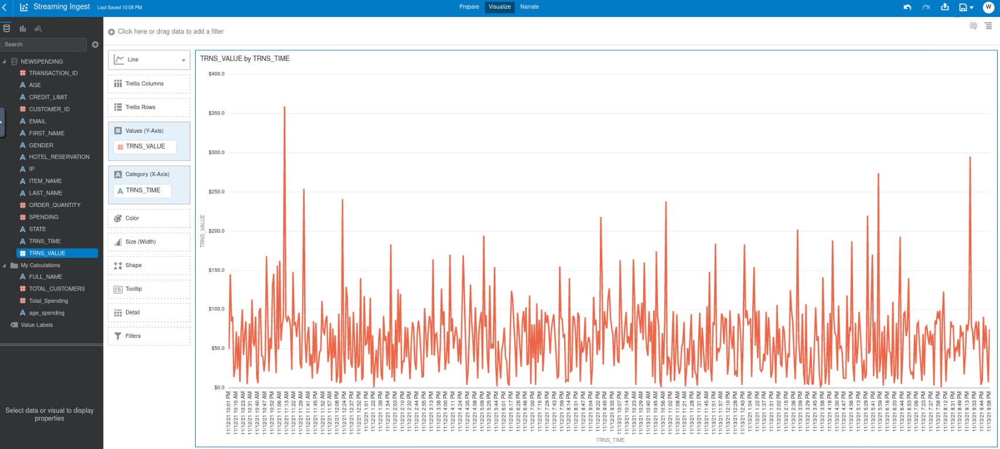

2. Select **Canvas 5** to observe the second line chart. Spending is charted as a comparison to the previous chart 

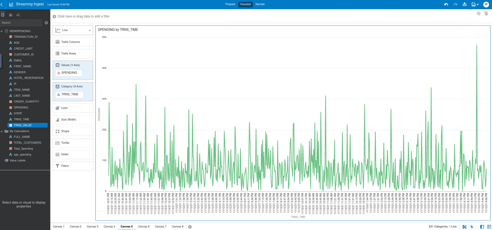

## Task 6: View Bar Chart

1. Select **Canvas 6** to observe the Customer data. You can quickly index by age or ID. This type of visualization is great to observe customers by the machine learning training data.

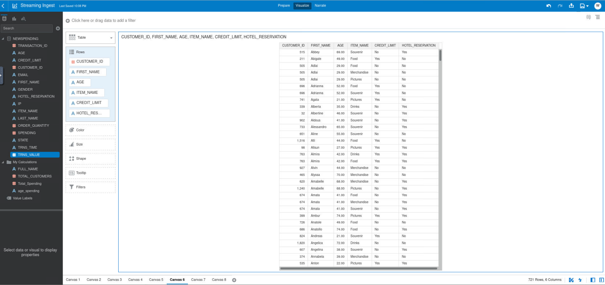

2. Select **Canvas 7** to observe the modified Customer Data. This table organizes the spending by the customers full name, using an advanced calculation feature by joining two columns.

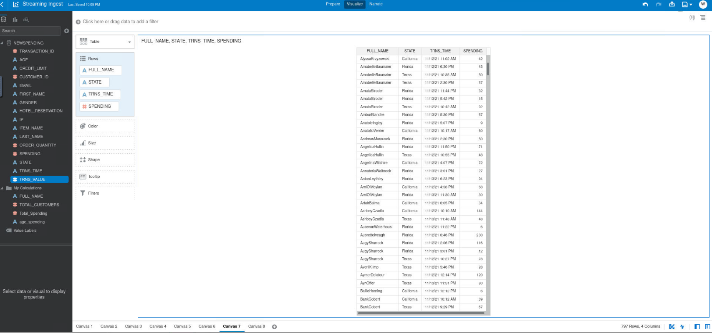

3. Select **Canvas 8** to view the three bar charts. The data is separated by Gender, State, and Age. USing these properties, you can create events tailored to a specific demographic. 

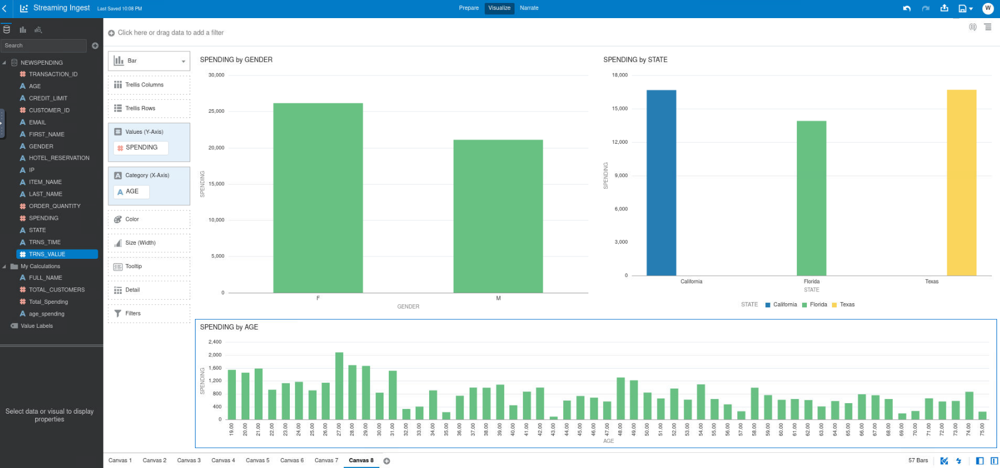

You have now completed the lab, thank you!

## Acknowledgements

- **Author**- Nicholas Cusato, Santa Monica Specialists Hub, July 14, 2022
- **Contributers**- Hadi Javaherian, Hannah Nguyen, Gia Villanueva, Akash Dahramshi
- **Last Updated By/Date** - Nicholas Cusato, Santa Monica Specialists Hub, July 14, 2022